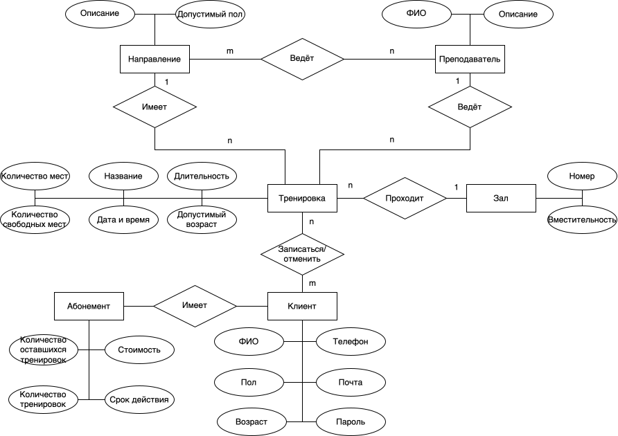

### Название проекта

Lost in Motion

---

### Краткое описание идеи проекта

Данный проект представляет собой приложение студии танцев. Данное приложение позволит автоматизировать запись клиентов на тренировки, информировать клиентов о месте и времени занятия, а так же предоставит необходимую информацию о самой студии, направлениях танцев, преподаваемых в ней и тренерах.

---

### Краткое описание предметной области

Предметная область включает в себя студии танцев. В данных студиях проходят занятия по различным танцевальным направлениям. Клиенты таких студий могут быть разных возрастов, полов, но всех их объединяет желание танцевать.

---

### Краткий анализ аналогичных решений по минимум 3 критериям

| Известное решение | Личный кабинет | Возможность просмотреть расписание | Возможность записаться на занятие |
| --- | --- | --- | --- |
| TODES | - | - | + |
| IDC | - | + | + |
| MDC NRG | - | + | + |
| Предлагаемое решение | + | + | + |

---

### Краткое обоснование целесообразности и актуальности проекта

На данный момент многие люди занимаются танцами начиная с детей и заканчивая людьми в возрасте. В связи с этим появляется всё больше студий танцев, которыми необходимо управлять (ставить тренировки, вести запись клиентов), что удобно делать с помощью сайта.

---

### Краткое описание ролей

- Администратор – изменяет информацию о тренировках, тренерах и студии.
- Гость – может изучить информацию о студии и занятиях.
- Клиент – в отличие от гостя может так же записаться на занятие, оставить отзыв.

---

### Use-Case – диаграмма

---

### ER-диаграмма сущностей

---

### Пользовательские сценарии

- Для регистрации необходимо ввести номер телефона, ФИО, возраст, пол и придумать пароль.
- Для авторизации необходимо ввести номер телефона и пароль.
- Для просмотра расписания пользователь может быть не авторизирован, однако для записи или написания отзыва авторизация необходима.
- Для записи на тренировку необходимо выбрать тренировку с нужным направлением и датой, однако чтобы записаться, необходимо иметь действующий абонемент.
- Для добавления новой тренировки необходимо указать дату, время, зал и тренера, однако если зал или тренер заняты в данное время, то тренировку добавить не получится.

---

### Сложные бизнес-кейсы

- Запись на тренировку (проверяется, что клиент ещё не записан в данное время, а также соответствие возраста возрастным ограничениям, наличие свободных мест и наличие действующего абонемента).
- Добавление тренировки (выбор тренера по данному направлению, времени, в которое он свободен, свободного зала и количества мест на тренировки, которое должно быть не больше вместительности зала).

---

### Формализация ключевых бизнес-процессов

---

### Описание типа приложения и выбранного технологического стека

Тип: Web

Язык: Go

База данных: PostgreSQL

---

### Верхнеуровневое разбиение на компоненты

---

### UML диаграммы классов для двух отдельных компонентов - компонента доступа к данным и компонента с бизнес-логикой

